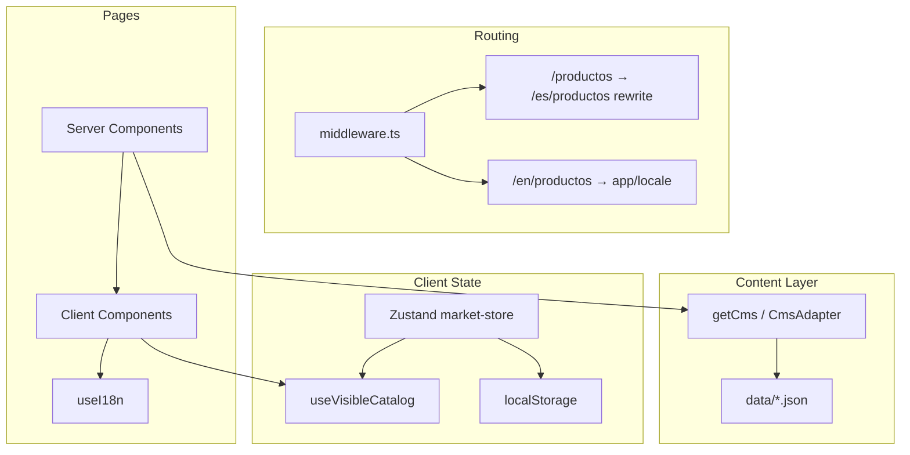

## Resumen de decisiones arquitectónicas — sitio Drija (Next.js)

Proyecto en `drija/`. Base moderna del sitio corporativo, sin e-commerce, pensada para escalar a CMS y multi-mercado.

---

### 1. Stack y fundamento

| Decisión | Detalle |
|----------|---------|
| **Framework** | Next.js 16 App Router + React 19 |
| **Estilos** | Tailwind CSS v4 como base; CSS Modules (`.module.css`) donde el layout es específico (header, blog, carruseles, footer) |
| **Tipado** | TypeScript estricto con tipos en `types/` |
| **Formularios** | Resend vía `POST /api/contact` |
| **Validación** | Zod en API/forms |
| **Animaciones / carruseles** | Framer Motion (mega menú); Swiper.js (hero home, Featured, Mundo DRIJA) |
| **Búsqueda** | Fuse.js en cliente, índice construido desde catálogo |

**Principio:** sitio de catálogo corporativo, no tienda online. El contacto y la navegación al retailer son los CTAs principales.

---

### 2. Enrutamiento e internacionalización (i18n)

**Dos idiomas:** `es` (default) y `en`.

**URLs canónicas:**
- Español sin prefijo: `/productos`, `/blog`, etc.
- Inglés con prefijo: `/en/productos`, `/en/blog`
- `/es/*` redirige a la URL sin prefijo

**Implementación:**
- Middleware reescribe rutas ES → `app/[locale]/...` internamente
- `messages/es.json` y `messages/en.json` → textos de UI (nav, labels, formularios)
- `I18nProvider` + hook `useI18n()` en cliente
- `getPageI18n()` en server components

**Separación clara:**
- **UI** → diccionarios JSON (`messages/`)
- **Contenido editorial/catálogo** → `data/*.json` con `translations.en`

---

### 3. Arquitectura de contenido (CMS)

**Patrón adaptador** en `lib/cms/`:

```
getCms() → CmsAdapter (interface)
         → jsonCmsAdapter (implementación actual)
         → sanity-adapter (futuro, no implementado)
```

**Decisiones:**
- Todo el contenido pasa por `getCms()` en server components
- JSON en `/data` como fuente mock, intercambiable sin tocar páginas
- `getFullCatalog(locale)` carga categorías + productos de una vez
- API routes internas (`/api/products`, `/api/blog`, etc.) exponen los mismos datos

**Localización de contenido:** `lib/i18n/localize-content.ts` fusiona `translations.en` sobre el objeto base en español. El español vive en la raíz del documento; el inglés en `translations.en`.

---

### 4. Configuración de página vs contenido editorial

Contenido de **página** (no entidades del catálogo) en JSON dedicados:

| Archivo | Uso |
|---------|-----|
| `hero-slides.json` | Hero home (imágenes por locale) |
| `featured-slides.json` | Sección “Lo nuevo” |
| `mundo-drija-slides.json` | Carrusel Mundo DRIJA |
| `where-to-buy.json` | Hero de dónde comprar |
| `blog-page.json` | Hero del blog (independiente de artículos) |
| `nav-megamenu.json` | Mega menú de categorías |
| `category-pages.json` | Config por categoría |

**Principio:** hero y settings de página ≠ posts/productos. Evita acoplar UI de landing a entidades editables.

---

### 5. Mercados / regiones (multi-país)

**Problema:** catálogo distinto por país/región sin duplicar productos.

**Modelo:**
- `MarketCode`: CAR, CR, SV, GT, HN, NI, PA, DO, VE, MX, ALL
- **Caribbean (`CAR`)** modelado como `type: "region"`, no como país
- **Panamá (`PA`)** es el mercado por defecto
- Productos y categorías tienen `availableMarkets[]`; `ALL` = visible en todos

**Estado global:** Zustand + `persist` en `localStorage` (`MarketStoreProvider` en `MainLayout`).

**Filtrado:**
- Catálogo completo se carga en server
- Filtro por mercado en **cliente** vía `useVisibleCatalog()` + `getVisibleCatalog()`
- Preparado para filtro server-side con `marketCode` en `CmsAdapter` / API cuando Sanity esté conectado

**UI:** `MarketSelector` en header + `MarketBar` (disclaimer verde).

---

### 6. Sanity (preparación, no conectado)

**Decisión:** schemas de referencia en `sanity/schemas/` (`market`, `category`, `product`) listos para copiar a un Studio externo.

**No implementado aún:**
- `sanity.config.ts`, Studio embebido, `sanity-adapter.ts`
- Dependencias npm de Sanity
- Variables de entorno activas (solo comentadas en `.env.example`)

**Puente:** `lib/cms/sanity-market-mapper.ts` normaliza `availableMarkets` de GROQ al mismo shape que JSON.

---

### 7. Componentes y capas

```
app/[locale]/          → Server Components (data fetching)
components/            → UI reutilizable
lib/                   → Lógica de negocio, loaders, filtros
hooks/                 → Lógica cliente (catálogo visible, búsqueda, carruseles)
stores/                → Estado global (mercado)
providers/             → Context providers (mercado)
types/                 → Contratos TypeScript
data/                  → Fuente de contenido mock
messages/              → i18n de interfaz
```

**Patrones:**
- **Server-first:** páginas cargan datos; pasan props a client components
- **Client islands:** grids filtrados, mega menú, búsqueda, blog tabs, formularios
- **Cards cliente con contexto:** `ProductCard`, `CategoryCard` usan `useI18n()` (no async en client)
- **Layout compartido:** `MainLayout` = Header + main + Footer + botón catálogo flotante

---

### 8. Navegación y header

- Header **sticky** con scroll state
- Nav principal renombrado a **“Categorías”** con **mega menú** (Framer Motion, datos desde JSON)
- Alias de ruta `/categorias` → listado de categorías
- **LocaleSwitcher** + **MarketSelector** en header
- **GlobalSearch** con prefetch de catálogo y Fuse.js
- Mega menú cierra con click fuera, Escape y cambio de ruta

---

### 9. Home

Secciones modulares con datos propios:

1. **HeroSlider** — Swiper horizontal, autoplay, dots, imágenes por locale
2. **HomeCategoryGrid** — categorías destacadas (filtradas por mercado en cliente)
3. **FeaturedTabsSection** — tabs + Swiper (3 slides desktop, hover zoom)
4. **MundoDrijaSlider** — reutiliza `HomeSwiperCarousel` (motor Swiper compartido)
5. **BlogCard** — posts destacados del blog
6. **ContactForm** — formulario inline

**Decisión:** carrusel compartido (`HomeSwiperCarousel` + `CarouselNavArrow`) para evitar duplicar lógica Swiper.

---

### 10. Catálogo y producto

**Listado:** `FilteredCategoryGrid` / `FilteredProductGrid` aplican filtro de mercado en cliente.

**Detalle de producto** descompuesto en:
- `ProductPageHero`, `ProductImageSlider`, `ProductMainCard`
- `ProductSpecsTable`, `ProductFeatureBlocks`, `RelatedProducts`

**Datos:** specs, features con imagen, galería, SKU, flags `featured` / `isNew`.

**Catálogo PDF:** botón flotante `CatalogDownloadButton` + script `catalog:generate`.

---

### 11. Blog

**Dos modos en `/blog`:**
- **Vista “Todas”:** hero (`blog-page.json`) + tabs centradas + grid 2 columnas
- **Vista categoría** (`?category=slug`): sidebar izquierdo + posts estilo featured (sin hero)

**Datos:**
- Artículos → `data/blog.json` vía CMS
- Hero → `data/blog-page.json` (entrada propia, imágenes en `/images/blog/hero/`)

---

### 12. Otras páginas

| Página | Decisión clave |
|--------|----------------|
| **Dónde comprar** | Hero + acordeón de países + tarjetas retailer con logo; config en `where-to-buy.json` |
| **Soporte** | FAQ por categoría + sección “¿Necesita ayuda?” con tarjetas verdes |
| **Contacto** | Formulario Resend; fallback dev sin API key |
| **Footer** | 4 columnas, categorías en 2 cols, links con borde, hover verde DRIJA |

---

### 13. Imágenes

- Componente `OptimizedImage` como wrapper sobre `next/image`
- Imágenes estáticas en `public/images/` organizadas por contexto (`hero/`, `blog/`, `blog/hero/`, etc.)
- Heroes y slides **por locale** donde aplica (es/en)

---

### 14. Marca visual

- Verde DRIJA: `#82b841` (token Tailwind `--color-drija-green` + CSS var)
- Tipografía: Montserrat
- Estética corporativa limpia; mucho blanco/gris + acentos verdes

---

### 15. Decisiones explícitamente diferidas

| Tema | Estado |
|------|--------|
| Sanity conectado | Pendiente |
| Filtrado de mercado en server/API | Opcional; hoy es cliente |
| Geolocalización automática de mercado | No implementada |
| Blog / soporte / retailers en Sanity | Sin schemas aún |
| E-commerce / checkout | Fuera de alcance |

---

### Diagrama simplificado



---

En una frase: **Next.js App Router + JSON mock con adaptador CMS + i18n en dos capas (UI vs contenido) + filtrado multi-mercado en cliente con Zustand**, con componentes modulares y configuración de página separada del contenido editorial, preparado para migrar a Sanity sin reescribir las páginas.